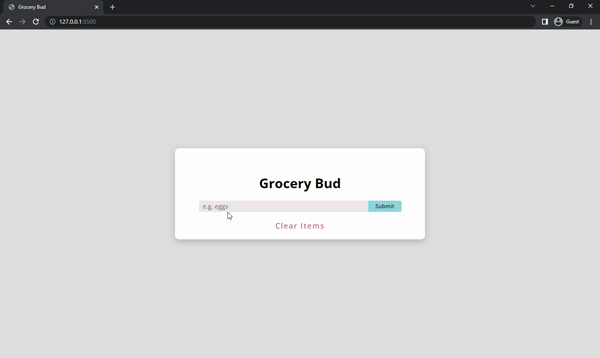

# GROCERY BUD
In this project, new elements can be added to the list. We can edit the elements and we can delete the elements we want. There is also a "Clear Items" button below so that we can clear the entire list.



## Used Technologies
* 

* 

* 

## Installation
First clone the project.
```
git clone https://github.com/saglamburcu/groceryBud-project.git
```

## Usage
After cloning the project, open it in Visual Studio Code.
```
cd groceryBud-project
code .
```